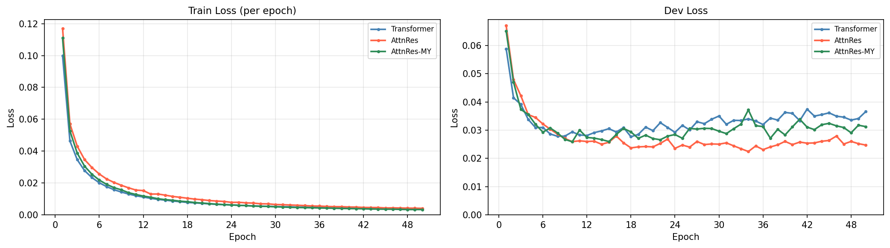
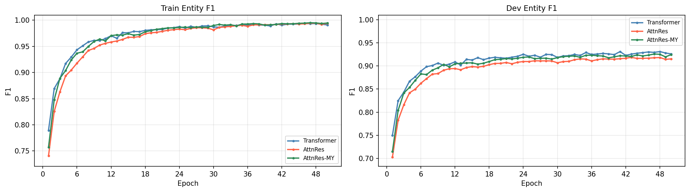
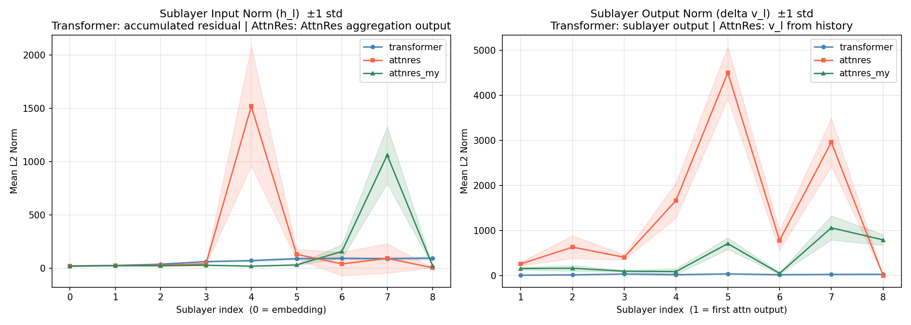
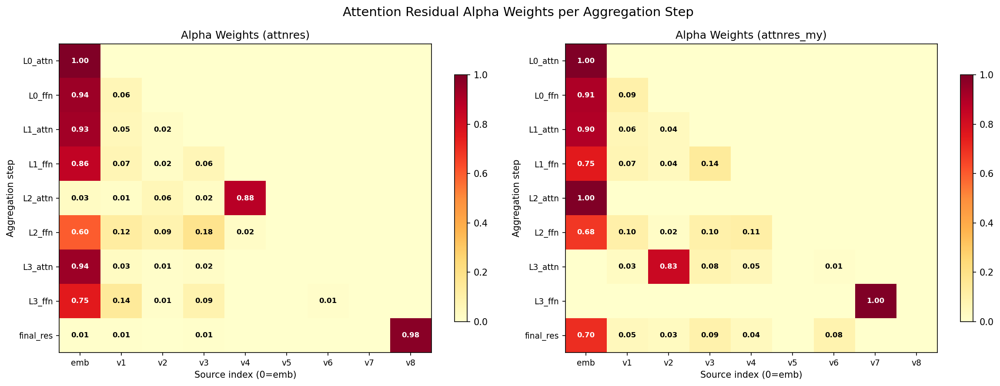

# NLP_NER_Transformer

基于 Transformer 的中文命名实体识别（NER），复现并对比了标准 Transformer 与 [Attention Residual（Kimi 论文）](https://arxiv.org/pdf/2603.15031) 两种残差机制。

> 飞书报告链接：https://ycn2fkrd1utz.feishu.cn/wiki/KA93wW2Mvimb1jkFt8BcQofDn1b

---

## 环境配置

```bash
conda create -n nlp-ner-transformer python=3.10 -y
conda activate nlp-ner-transformer
pip install jupyter ipykernel matplotlib
pip3 install torch torchvision --index-url https://download.pytorch.org/whl/cu124
```

---

## 项目架构

```
NLP_NER_Transformer/
├── train.py                    # 主训练脚本（Transformer / AttnRes / AttnRes-MY）
├── eval.py                     # 评估脚本（dev 集上各实体类型的 P/R/F1）
├── case_study.py               # 案例分析（FP/FN 展示、双模型对比）
├── hidden_states.py            # 各层 hidden state L2 范数分析与可视化
├── analyze_peak.py             # AttnRes 聚合注意力权重可视化
├── plot_history.py             # 训练曲线可视化（Loss/F1/P/R/Acc 对比）
├── data_proc.ipynb             # 数据预处理 notebook
│
├── models/                     # 模型定义
│   ├── TransformerNER.py                   # 标准 Transformer NER 模型
│   ├── TransformerEncoder.py               # Transformer Encoder（层堆叠）
│   ├── TransformerEncoderLayer.py          # 单层 Encoder（PreNorm: norm→attn→norm→ffn）
│   ├── Attention_Residual_Kimi.py          # AttnRes NER 模型（论文复现 + MY 变体）
│   ├── AttnResTransformerEncoder.py        # AttnRes Encoder（层堆叠 + final_res 最终聚合）
│   ├── AttnResTransformerEncoderLayer.py   # AttnRes 单层（attn_res→attn→ffn_res→ffn）
│   ├── FullAttentionResidual.py            # 注意力残差聚合模块（论文原版 + MY 变体）
│   ├── MultiHeadSelfAttention.py           # 多头自注意力（手写实现）
│   ├── FFN.py                              # 前馈网络（Linear→ReLU→Linear）
│   ├── positional_encoding.py              # 正弦位置编码
│   └── Normalization.py                    # RMSNorm
│
├── tools/                      # 工具函数
│   ├── configer.py             # 命令行参数解析
│   ├── loader.py               # 数据加载、meta 信息读取、工具函数
│   ├── builder.py              # DataLoader 和模型的构建工厂
│   └── trainer.py              # 训练/评估循环、实体抽取
│
├── dataset/
│   └── dataset.py              # NERDataset（字符→id、标签→id、padding）
│
├── data/                       # 原始数据
│   ├── train.txt / train_TAG.txt
│   └── dev.txt / dev_TAG.txt
│
├── meta/                       # 预处理后的映射表
│   ├── char2id.json / id2char.json
│   └── tag2id.json / id2tag.json    # BIO 标签（B_LOC, I_LOC, B_ORG, I_ORG, B_PER, I_PER, B_T, I_T, O）
│
├── checkpoints/                # 模型存档（best_model.pt + history.json）
│   ├── transformer/
│   ├── attnres_transformer/
│   └── attnres_transformer_my/
│
└── docs/
    └── report.md
```

---

## 模型架构

三个模型共享 Embedding + 正弦位置编码 + Linear 分类头，区别在 Encoder 内部的残差机制：

| 模型 | 残差方式 | 说明 |
|------|---------|------|
| `transformer` | `h_l = h_{l-1} + sublayer(norm(h_{l-1}))` | 标准 PreNorm 残差，基线模型 |
| `attnres_transformer` | `h_l = Σ α_i · v_i`，α 由 RMSNorm + 可学习 query 计算 | 论文 Full Attention Residual 复现 |
| `attnres_transformer_my` | `h_l = Σ α_i · v_i`，α 由 masked mean pooling + 线性投影计算 | 自定义变体 |

### 训练超参数

| 参数 | 值 |
|------|-----|
| d_model | 256 |
| n_heads | 4 |
| d_ff | 512 |
| num_layers | 4 |
| dropout | 0.1 |
| lr | 1e-3 |
| batch_size | 32 |
| num_epochs | 50 |

---

## 实验结果

### Dev 集整体表现

| 模型 | Dev F1 | Dev Precision | Dev Recall | Dev Loss (min) |
|------|--------|---------------|------------|----------------|
| Transformer | **0.9310** | 0.9215 | 0.9407 | 0.0277 |
| AttnRes | 0.9271 | 0.9182 | 0.9362 | 0.0246 |
| AttnRes-MY | 0.9278 | 0.9174 | 0.9385 | 0.0264 |

### 各实体类型 F1（Transformer vs AttnRes）

| 实体类型 | Transformer | AttnRes | 差异 |
|---------|-------------|---------|------|
| LOC | 0.9330 | 0.9272 | -0.0058 |
| ORG | 0.8724 | 0.8919 | **+0.0195** |
| PER | 0.9665 | 0.9553 | -0.0112 |
| T | 0.9432 | 0.9407 | -0.0025 |
| ALL (micro) | **0.9310** | 0.9271 | -0.0039 |

> AttnRes 在 ORG（组织机构）上表现更好（+0.0195），但在 PER（人名）上明显下降（-0.0112），整体 F1 略低于 Transformer。

### 训练曲线





---

## Hidden State 范数分析



- **左图**：各子层输入 h_l 的 L2 范数（Transformer = 残差累积状态，AttnRes = 聚合输出），均未过 LayerNorm
- **右图**：各子层输出 v_l 的 L2 范数（存入 history / 加到残差上的增量）

**关键发现：**

1. **Transformer（蓝线）**：h_l 范数从 21 平缓增长到 94，v_l 稳定在 10~40。4 层模型下 PreNorm dilution 问题不显著
2. **AttnRes（红线）**：h_l 在第 5 子层（L2_attn 前）出现 peak（~1500），v_l 在对应位置飙升至 ~4500
3. **AttnRes-MY（绿线）**：peak 出现在第 7 子层（L3_attn 前），幅度较温和（~1060）

---

## Peak 成因分析



通过逐层分析 alpha 权重分配，定位 peak 的根因：

**AttnRes**：L2_attn 将 88% 的 alpha 权重集中给了 v4（范数最大的 source），导致 input_norm 被拉大，经 ~130x 的 attention 放大率后产生 peak

**AttnRes-MY**：L3_attn 将 83% 权重给了 v2，同时 LayerNorm weight 异常大（15.81 vs 正常 2~3），两者叠加导致 peak

**根本原因**：embedding 范数（~19）与各层 v 范数（200~500）差一个数量级，softmax 无法在两类尺度差异巨大的 source 之间平滑分配权重，导致 alpha 要么退化选 emb（放弃聚合），要么集中选 v（引发 peak）。这说明 Full Attention Residual 在浅层模型（4层）上不仅没有解决不存在的 PreNorm dilution 问题，反而引入了新的训练不稳定性。

---

## 训练指令

```bash
# Transformer 基线
python train.py \
  --exp_name transformer \
  --model_name transformer \
  --batch_size 32 --lr 1e-3 --num_epochs 50 \
  --d_model 256 --n_heads 4 --d_ff 512 --num_layers 4 \
  --max_len 5000 --dropout 0.1 --device cuda

# AttnRes（论文复现）
python train.py \
  --exp_name attnres_transformer \
  --model_name attnres_transformer \
  --batch_size 32 --lr 1e-3 --num_epochs 50 \
  --d_model 256 --n_heads 4 --d_ff 512 --num_layers 4 \
  --max_len 5000 --dropout 0.1 --device cuda

# AttnRes-MY（自定义变体）
python train.py \
  --exp_name attnres_transformer_my \
  --model_name attnres_transformer_my \
  --batch_size 32 --lr 1e-3 --num_epochs 50 \
  --d_model 256 --n_heads 4 --d_ff 512 --num_layers 4 \
  --max_len 5000 --dropout 0.1 --device cuda
```

### 分析脚本

```bash
# 细粒度评估
python eval.py --model_name transformer
python eval.py --model_name attnres_transformer

# 训练曲线可视化
python plot_history.py

# Hidden state 范数分析
python hidden_states.py

# AttnRes alpha 权重可视化
python analyze_peak.py --model both
```
