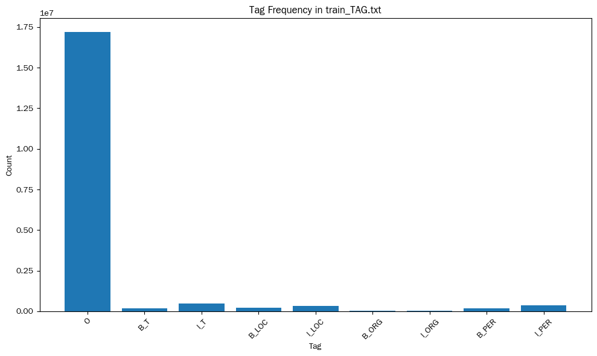
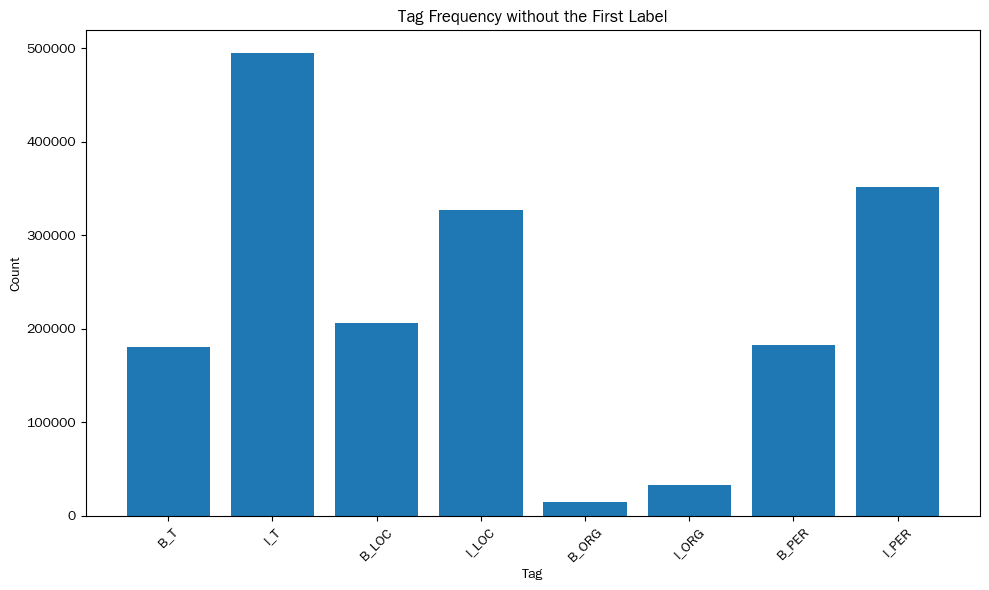

# 标注集获取

## 方法说明
- 获取方法（展示code）

```python
# NLP_NER_Transformer/data_proc.ipynb
# 标签统计
train_TAG_path="data/train_TAG.txt"
with open(train_TAG_path, "r", encoding="utf-8") as f:
    tags = f.read().split()   # 自动忽略空格、换行、分段
    
from collections import Counter 
label_set = sorted(set(tags))                 # 标签集
tag_count = Counter(tags)                     # 各标签频次
tag2id = {tag: idx for idx, tag in enumerate(label_set)}
id2tag = {idx: tag for tag, idx in tag2id.items()}
```
```python
# NLP_NER_Transformer/data_proc.ipynb
# 处理一下字符统计
# 说明：B表示begin，I表示in。B_T表示时间实体的开头，I_T表示时间实体内部字符。LOC表示地点实体（location），ORG表示机构实体（organization），PER表示人物实体（PERSON）
# 数据在txt中以行为基本单位，一行对应一个完整的句子
train_DATA_path="data/train.txt"
char_counter = Counter()

with open(train_DATA_path, "r", encoding="utf-8") as f:
    for line in f:
        chars = line.strip().split()
        char_counter.update(chars)

char2id = {
    "<PAD>": 0,
    "<UNK>": 1,
}

for ch, _ in char_counter.items():
    char2id[ch] = len(char2id)

id2char = {idx: ch for ch, idx in char2id.items()}
```
- 获取结果（展示结果，图片）
```json
// NLP_NER_Transformer/meta/id2tag.json
{
  "0": "B_LOC",
  "1": "B_ORG",
  "2": "B_PER",
  "3": "B_T",
  "4": "I_LOC",
  "5": "I_ORG",
  "6": "I_PER",
  "7": "I_T",
  "8": "O"
}
```
<div style="display: flex; gap: 16px; justify-content: center;">
<div style="text-align: center;">
  
  <p>图1：训练损失曲线</p>
</div>
<div style="text-align: center;">
  
</div>
</div>

## 结果展示

```python for epoch in range(10): train() evaluate() save_model() ```

# 模型代码说明

## 模型架构


## 训练超参数配置


## 实现粒度说明
- 细粒度实现了：多头自注意力，位置编码（插入实现代码讲解）
- 直接使用了： nn.Embedding，nn.Dropout,LayerNorm


# 训练结果展示


# 模型显存分析见memory_cost.ipynb


# 参考文献与大模型使用说明